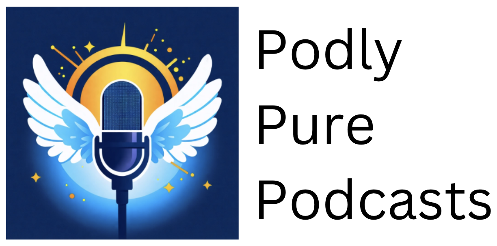
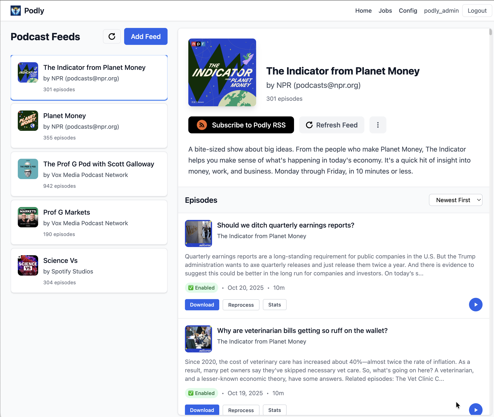

<h2 align="center">

</h2>

Ad-block for podcasts. Create an ad-free RSS feed.

  

## Overview

Podly uses Whisper and Chat GPT to remove ads from podcasts.

## How To Run

You have a few options to get started:

- 
   - quick and easy setup in the cloud, follow our [Railway deployment guide](docs/how_to_run_railway.md). 
   - Use this if you want to share your Podly server with others.
- **Run Locally**: 
   - For local development and customization, 
   - see our [beginner's guide for running locally](docs/how_to_run_beginners.md). 
   - Use this for the most cost-optimal & private setup.
- **[Join The Preview Server](https://podly.up.railway.app/)**: 
   - support the project through code contribution or sponsorship
   - get account  

## How it works:

- You request an episode
- Podly downloads the requested episode
- Whisper transcribes the episode
- LLM labels ad segments
- Podly removes the ad segments
- Podly delivers the ad-free version of the podcast to you

### Cost Breakdown
*Monthly cost breakdown for 5 podcasts*

| Cost    | Hosting  | Transcription | LLM    |
|---------|----------|---------------|--------|
| **free**| [preview server](https://podly.up.railway.app/)    | n/a         | n/a  |
| **free**| local    | local         | local  |
| **$2**  | local    | local         | remote |
| **$5**  | local    | remote        | remote |
| **$10** | public (railway)  | remote        | remote |
| **$6** | [zeroads](https://zeroads.ai?utm_source=podly)  | for-profit fork of Podly | remote |
| ? | do you run an ad removal service? | get listed here | sponsor or contribute to project 😀 |

## Contributing

See [contributing guide](docs/contributors.md) for local setup & contribution instructions.
