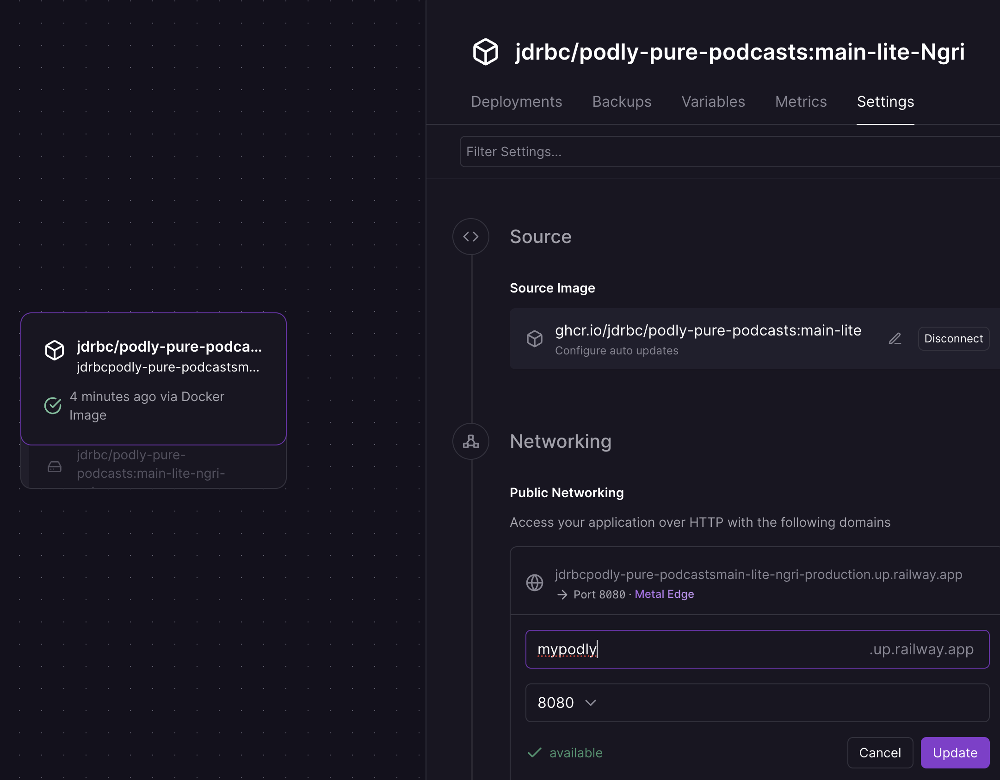

# How to Run on Railway

This guide will walk you through deploying Podly on Railway using the one-click template.

## 0. Important! Set Budgets

Both Railway and Groq allow you to set budgets on your processing. Set a $10 (minimum possible, expect smaller bill) budget on Railway. Set a $5 budget for Groq.

## 1. Get Free Groq API Key

Podly uses Groq to transcribe podcasts quickly and for free.

1.  Go to [https://console.groq.com/keys](https://console.groq.com/keys).
2.  Sign up for a free account.
3.  Create a new API key.
4.  Copy the key and paste it into the `GROQ_API_KEY` field during the Railway deployment.

## 2. Deploy Railway Template

Click the button below to deploy Podly to Railway. This is a sponsored link that supports the project!

If you want to be a beta-tester, you can deploy the preview branch instead:

## 3. Configure Networking

After the deployment is complete, you need to expose the service to the internet.

1.  Click on the new deployment in your Railway dashboard.
2.  Go to the **Settings** tab.
3.  Under **Networking**, find the **Public Networking** section and click **Generate Domain**.
4.  You can now access Podly at the generated URL.
5.  (Optional) To change the domain name, click **Edit** and enter a new name.

## 4. Set Budgets & Expected Pricing

Set a $10 budget on Railway and a $5 budget on Groq (or use the free tier for Groq which will slow processing).

Podly is designed to run efficiently on Railway's hobby plan.

If you process a large volume of podcasts, you can check the **Config** page in your Podly deployment for estimated monthly costs based on your usage.

## 5. Secure Your Deployment

Podly now uses secure session cookies for the web dashboard while keeping HTTP Basic authentication for RSS feeds and audio downloads. Before inviting listeners, secure the app:

1. In the Railway dashboard, open your Podly service and head to **Variables**.
2. Add `REQUIRE_AUTH` with value `true`.
3. Add a strong `PODLY_ADMIN_PASSWORD` (minimum 12 characters including uppercase, lowercase, digit, and symbol). Optionally set `PODLY_ADMIN_USERNAME`.
4. Provide a long, random `PODLY_SECRET_KEY` so session cookies survive restarts. (If you omit it, Podly will generate a new key each deploy and sign everyone out.)
5. Redeploy the service. On first boot Podly seeds the admin user and requires those credentials on every request.

> **Important:** Enabling auth on an existing deployment requires a fresh data volume. Create a new Railway deployment or wipe the existing storage so the initial admin can be seeded.

After signing in, use the Config page to change your password, add additional users, and copy RSS links via the "Copy protected feed" button. Podly issues feed-specific access tokens and embeds them in each URL so listeners can subscribe without knowing your main password. When you rotate passwords, update the corresponding Railway variables so restarts succeed.

## 6. Using Podly

1.  Open your new Podly URL in a browser.
2.  Navigate to the **Feeds** page.
3.  Add the RSS feed URL of a podcast you want to process.
4.  Go to your favorite podcast client and subscribe to the new feed URL provided by Podly (e.g., `https://your-podly-app.up.railway.app/feed/1`).
5.  Download and enjoy ad-free episodes!
